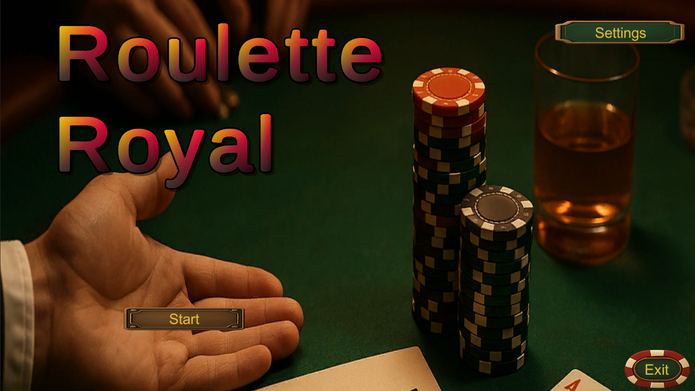
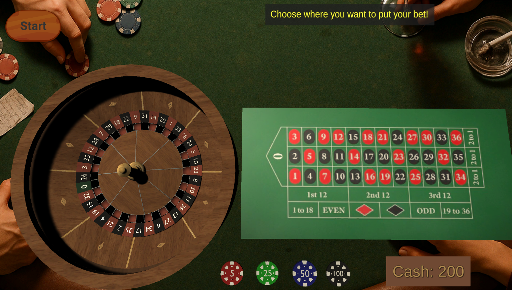

## 🎯 Roulette Ball Physics Game

This is a simple roulette game I made in Unity. The ball is launched with a bit of randomness and spins around using Unity's physics, so the final result feels real and unpredictable. Just a fun experiment that turned into a full little game.

---

## 🎮 What’s Inside

\- Ball is launched with real physics

\- Detects which number the ball lands on

\- Restart and main menu with UI

\- Background music and sound effects

\- Built-in for WebGL and PC (tested)

---

## 🗂️ Project Structure

Here’s how I organized the Assets folder:

Assets/

├── Art/ # All visuals, images

├── Audio/ # Music and SFX

├── Prefabs/ # Reusable game objects

├── Scenes/ # Game and menu scenes

├── Scripts/ # All C# code

├── UI/ # Buttons, texts, fonts

---

## 🛠️ Made With

\- Unity 2020.3.31f1 (LTS)

\- C# scripting

\- Unity Physics \& Rigidbody

\- Unity UI System

\- Windows 11

---

## 📸 Screenshots

  

---

## 🌐 Play Online

[▶️ Play on itch.io](https://el-legato.itch.io/roulette)

---

👨‍💻 Made By

Tony – I like experimenting with Unity and this is one of my first fun projects.

---

📄 License

This project is open-source and free to use for learning or inspiration. Do whatever you want with it.

